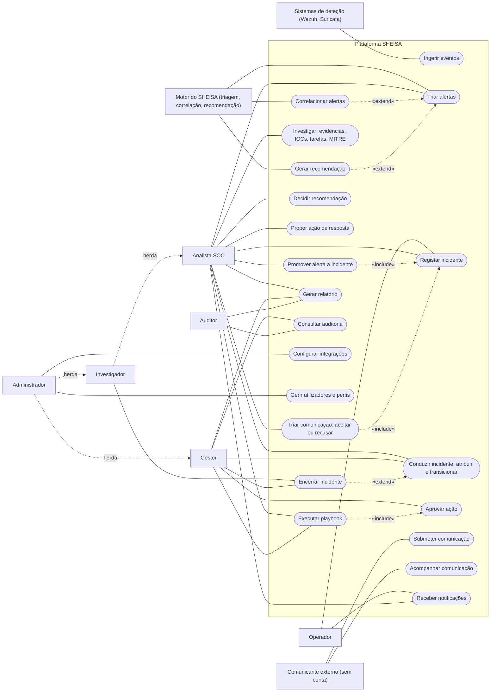

# SHEISA — Diagrama de casos de uso

Quem usa a plataforma, e o que cada um pode fazer. Os actores são os **seis
perfis** do controlo de acessos (RBAC) do SHEISA, mais os actores externos que
interagem com o sistema sem serem operadores humanos. Os casos de uso
correspondem a funcionalidades reais — cada um existe no código e nas permissões.

## Notação

| Elemento | Significado |
|---|---|
| Rectângulo (à esquerda) | **Actor** — quem interage com o sistema. |
| Forma oval, dentro da caixa | **Caso de uso** — uma função que o sistema oferece. |
| Caixa "Plataforma SHEISA" | **Fronteira do sistema** — o que é do sistema fica dentro. |
| Linha simples (actor — caso) | **Associação** — o actor usa aquele caso. |
| `-.-> «include»` | O caso de uso **inclui sempre** outro (o outro faz parte dele). |
| `-.-> «extend»` | O caso de uso **estende** outro (acontece só em certas condições). |
| `-.-> herda` | **Generalização de actor** — herda todos os casos de uso do actor apontado. |

## Diagrama

## Os actores

**Humanos (os seis perfis do RBAC):**

- **Operador** — perfil mínimo. Regista ocorrências e acompanha; não investiga
  nem decide.
- **Analista SOC** — a primeira linha. Tria alertas, promove-os a incidente,
  conduz e investiga o incidente, propõe ações, corre playbooks e tria as
  comunicações externas. **Não encerra** incidentes.
- **Investigador** — *herda* tudo o que o Analista faz e acrescenta o poder de
  **encerrar** incidentes e de gerir *threat intelligence* e activos.
- **Gestor** — coordena, não investiga. É quem **aprova as ações disruptivas**
  (incluindo as críticas), atribui, encerra e consulta a auditoria.
- **Auditor** — só leitura, incluindo o registo de auditoria. É o que dá valor
  probatório à consulta: não pode alterar nada.
- **Administrador** — *herda* Gestor e Investigador e acrescenta a gestão de
  **utilizadores, perfis e integrações**. Acesso total.

**Não humanos / externos:**

- **Sistemas de deteção (Wazuh, Suricata)** — alimentam o sistema com eventos,
  autenticados por chave de ingestão. Não têm ecrã: só entregam dados.
- **Motor do SHEISA** — os motores determinísticos que pontuam a triagem,
  correlacionam alertas e **geram** recomendações automaticamente. Note-se a
  separação: o Motor *gera* recomendações, mas quem as *decide* é sempre uma
  pessoa.
- **Comunicante externo** — qualquer pessoa, **sem conta**, que participa um
  incidente pelo portal público (ao estilo do RTIR) e depois acompanha o estado
  com uma referência e um código.

## Relações que vale a pena explicar

- **Promover alerta a incidente «include» Registar incidente** — promover um
  alerta *é* criar um incidente a partir dele; a criação faz parte da promoção.
- **Triar comunicação «include» Registar incidente** — aceitar uma comunicação
  externa liga-a a um incidente, novo ou existente. Uma comunicação aceite sem
  incidente seria um estado que mente, por isso a ligação é obrigatória.
- **Executar playbook «include» Aprovar ação** — um playbook que chega a um passo
  de ação disruptiva suspende-se e espera a aprovação humana. A automação não
  contorna o controlo: por isso a aprovação faz parte da execução.
- **Encerrar incidente «extend» Conduzir incidente** — encerrar é uma transição
  como as outras, mas só acontece no fim e **exige a permissão `incidents:close`**
  — que o Analista não tem e o Investigador e o Gestor têm.
- **Correlacionar / Gerar recomendação «extend» Triar** — acontecem em cima da
  triagem, automaticamente, quando as condições se verificam.

## Guião para explicar em três frases

1. Os dados entram por **actores não humanos** (Wazuh/Suricata ingerem eventos; o
   Motor tria e correlaciona) ou por um **comunicante externo** sem conta.
2. A **primeira linha** (Analista) tria, promove e investiga; a **segunda linha**
   (Investigador) fecha; a **coordenação** (Gestor) aprova o que é disruptivo — a
   plataforma separa deliberadamente quem conduz de quem dá por terminado e de
   quem autoriza.
3. Tudo o que altera o sistema fica no **registo de auditoria**, que o **Auditor**
   consulta sem poder mudar — é o que sustenta a defensabilidade do processo.
