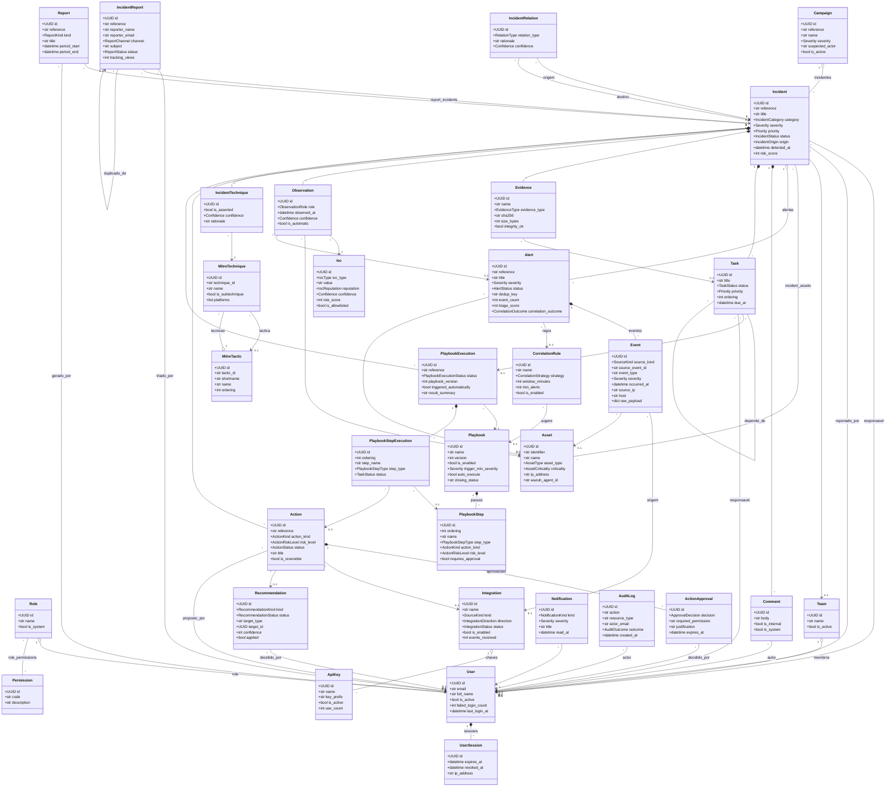

# SHEISA — Diagrama de classes (modelo de domínio)

Diagrama das 33 entidades do domínio do SHEISA e das suas relações, extraído
directamente dos modelos SQLAlchemy em [`backend/app/models/`](../backend/app/models/).
Nada aqui é inventado: classes, atributos e relações correspondem ao código.

> **Para a monografia:** as imagens prontas e a fonte UML estão em
> [`docs/diagramas/`](diagramas/) — `classes.png` (inserir), `classes.svg`
> (escalável, melhor para impressão) e `classes.puml` (fonte PlantUML, editável e
> importável no draw.io). Ver as instruções no fim deste documento.

Para poupar espaço, cada classe mostra os atributos identificadores e alguns de
domínio, não todos. As chaves estrangeiras aparecem como relações (associações),
não como atributos. Quase todas as entidades registam ainda um `created_by_id`
para o `User` que as criou; essas ligações foram omitidas do desenho para não o
sobrecarregar.

## Notação

| Símbolo | Significado |
|---|---|
| `*--` | **Composição** — o filho não existe sem o pai; apagar o pai apaga o filho (`ON DELETE CASCADE`). |
| `o--` | **Agregação** — referência forte, mas o filho sobrevive ao pai (`ON DELETE SET NULL`/`RESTRICT`). |
| `-->` | **Associação** — uma entidade referencia outra. |
| `--` | **Ligação muitos-para-muitos**, através de uma tabela de associação. |
| `"1"`, `"*"`, `"0..1"` | Cardinalidades nas pontas da relação. |

As quatro tabelas de associação são `role_permissions`, `incident_assets`,
`task_dependencies` e `report_incidents`.

## Módulos

- **Identidade e acesso** — `User`, `Role`, `Permission`, `Team`, `UserSession`, `ApiKey`
- **Deteção** — `Event`, `Alert`, `CorrelationRule`
- **Incidente** — `Incident`, `IncidentRelation`, `IncidentTechnique`
- **Catálogo e intelligence** — `Asset`, `Ioc`, `Campaign`, `MitreTactic`, `MitreTechnique`
- **Investigação** — `Observation`, `Comment`, `Task`, `Evidence`
- **Resposta** — `Playbook`, `PlaybookStep`, `PlaybookExecution`, `PlaybookStepExecution`, `Action`, `ActionApproval`
- **Recomendações** — `Recommendation`
- **Comunicação externa** — `IncidentReport`
- **Sistema** — `Integration`, `Notification`, `Report`, `AuditLog`

## Diagrama

## Guião de explicação (para defender o diagrama)

O modelo foi desenhado à volta de cinco decisões. Quem apresentar deve conseguir
explicar cada uma — são elas que distinguem o SHEISA de uma cópia do RTIR ou do
TheHive.

### 1. Event ≠ Alert ≠ Incident — três classes, não uma

- **Event** é um facto bruto de uma fonte (uma linha do Wazuh ou do Suricata).
- **Alert** agrupa eventos pela `dedup_key` e já traz a pontuação da triagem; um
  alerta reúne muitos eventos (`Alert "1" *-- "*" Event`).
- **Incident** é o caso que **uma pessoa decide tratar**. Nasce de um alerta
  promovido, de correlação, de um playbook, de escalamento ou de uma comunicação
  externa — é o que o campo `origin` regista.

> Em uma frase: a granularidade cresce de Event para Alert para Incident, e cada
> nível é uma classe com o seu próprio ciclo de vida. Juntá-los numa só tabela
> perderia a distinção entre "o que a máquina viu" e "o que decidimos investigar".

### 2. IOC global vs Observação contextual

- **Ioc** é o indicador em si — um IP, um hash — único e global, com reputação e
  risco próprios.
- **Observation** liga um `Ioc` a um `Incident` **num papel** (origem, alvo,
  artefacto…). O mesmo IP pode ser o atacante num incidente e o alvo noutro.

> Em uma frase: separámos *o que o indicador é* (global, na base de conhecimento)
> de *o que ele significou aqui* (contextual, no caso). É a `Observation` que
> carrega o papel, não o `Ioc`.

### 3. Modelo de resposta separado da sua execução

- **Playbook** e **PlaybookStep** são o procedimento — o que *se deve* fazer.
- **PlaybookExecution** e **PlaybookStepExecution** são uma corrida concreta — o
  que *se fez*, passo a passo, com o resultado de cada um.
- **Action** é uma medida (bloquear IP, isolar host); se for disruptiva, exige
  uma **ActionApproval** antes de executar.

> Em uma frase: o registo do que aconteceu (`PlaybookExecution`) não muda quando
> alguém edita o procedimento (`Playbook`) — por isso são classes separadas, e a
> execução guarda a `playbook_version` que correu.

### 4. Auditoria imutável (append-only)

- **AuditLog** regista quem (`actor`/`api_key`), o quê (`action`), sobre o quê
  (`resource`), e o antes/depois (`old_value`/`new_value`). Repare que só tem
  **associações** para fora, nunca composições: nada o apaga em cascata, porque
  um registo de auditoria não se apaga.

### 5. O que as pontas das setas afirmam

| Relação | Exemplo no diagrama | O que significa |
|---|---|---|
| Composição `*--` | `Incident *-- Comment` | Apagar o incidente apaga os comentários. |
| Agregação `o--` | `Role o-- User` | Apagar um perfil **não** apaga os utilizadores (é restrito). |
| Muitos-para-muitos `--` | `Incident -- Asset` | Um incidente afecta vários activos; um activo aparece em vários incidentes. |

### Números para citar

33 entidades · 4 tabelas de associação · 9 módulos. Desde a migração
`0007_check_enumeracoes`, os valores das enumerações são impostos por restrição
CHECK na própria base de dados, não apenas pela aplicação.

## Como usar os ficheiros (para a monografia)

Em [`docs/diagramas/`](diagramas/) estão os dois diagramas (classes e casos de
uso) em três formatos:

| Ficheiro | Para quê |
|---|---|
| `classes.png` / `casos-de-uso.png` | Inserir directamente num documento Word. |
| `classes.svg` / `casos-de-uso.svg` | **Escalável** — não fica pixelizado ao ampliar nem ao imprimir. Preferir em LaTeX/PDF. |
| `classes.puml` / `casos-de-uso.puml` | Fonte **PlantUML** (UML a sério). Para editar e voltar a exportar. |

**Editar e re-exportar** (se precisar de mudar algo):

1. **Online, sem instalar nada:** abrir <https://www.plantuml.com/plantuml>,
   colar o conteúdo do `.puml`, e descarregar em PNG ou SVG.
2. **No draw.io / diagrams.net:** *Arrange → Insert → Advanced → PlantUML…*,
   colar o `.puml`. Fica editável como formas do draw.io.
3. **No VS Code:** instalar a extensão *PlantUML* e pré-visualizar com `Alt+D`.

As imagens são geradas a partir do `.puml`; se o modelo mudar, reexportar.

